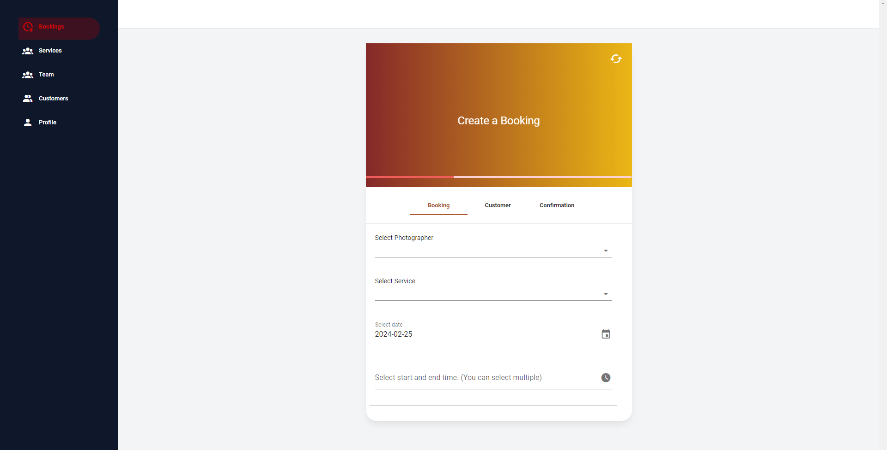
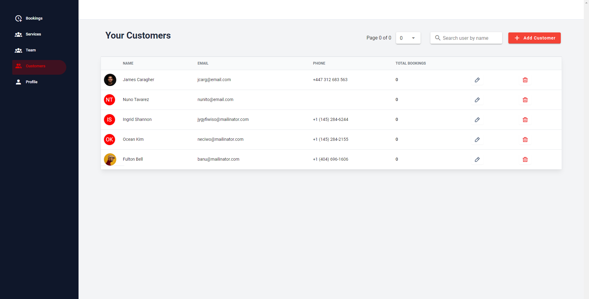
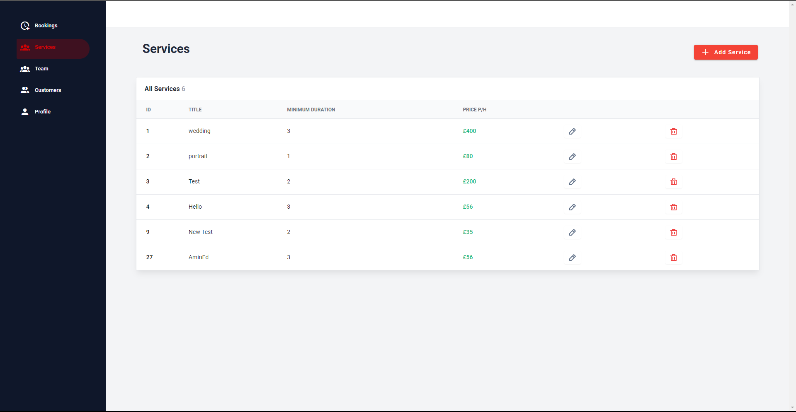
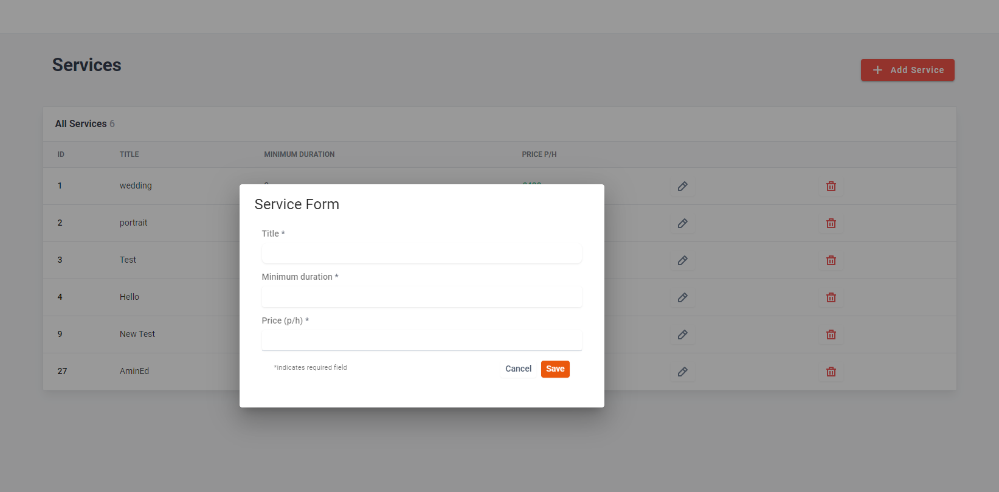
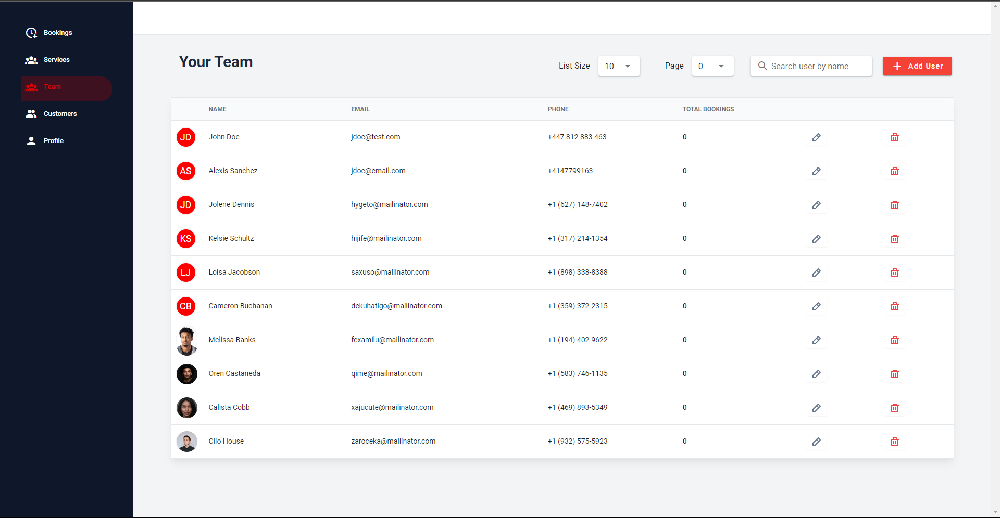
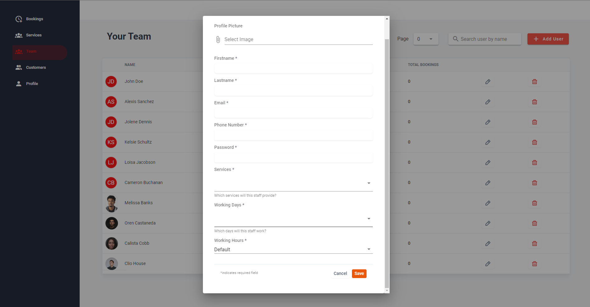

# bookme
A Vue SPA app with the following functionalities:
- Create bookings based on staff working hours and availability
- Create staff with custom working hours/days and specific services they offer
- Create teams
- Create customer records
- See how many bookings a customer has made
- Uses vue router to manage navigation
- Uses Vuex for state management
- Uses axios to interact with backend API

## Screenshots
<details>
<summary>app pages</summary>






</details>

## Project setup
```
npm install
```

### ENV file
Add .env file to the root path and copy contents of .env.example.
Then update `VUE_APP_API_URL`.

### Compiles and hot-reloads for development
```
npm run serve
```

### Compiles and minifies for production
```
npm run build
```

### Lints and fixes files
```
npm run lint
```

### Customize configuration
See [Configuration Reference](https://cli.vuejs.org/config/).
